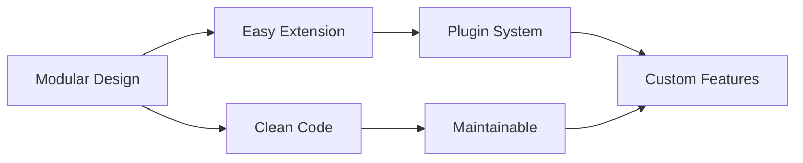

<div align="center">


# 🚀 Velstore

### Open-Source Multi-Vendor eCommerce Platform Built with Laravel

*Empower your business with a fully customizable, scalable, and feature-rich marketplace solution*

[](https://packagist.org/packages/velstorelabs/velstore)
[](https://github.com/velstorelabs/velstore/releases)
[](https://github.com/velstorelabs/velstore/actions/workflows/ci.yml)
[](https://github.com/velstorelabs/velstore/blob/master/LICENSE)

[🌐 Live Demo](#) • [📖 Documentation](#) • [💬 Community](#) • [🐛 Report Bug](#) • [✨ Request Feature](#)

---


</div>

## ✨ Why Velstore?

Velstore isn't just another eCommerce platform—it's a complete marketplace ecosystem designed for entrepreneurs, developers, and businesses who want **full control** over their online store without compromise.

```bash
🎯 Zero Configuration Hassle  •  🔧 Infinitely Customizable  •  🌍 Global Ready  •  🚀 Production Ready
```

---

## 🎨 Key Features

<table>
<tr>
<td width="50%">

### 🏪 **Multi-Vendor Architecture**
- Dedicated admin, seller & customer panels
- Individual vendor storefronts
- Commission & revenue management
- Vendor analytics dashboard

### 🌐 **Global Commerce**
- **19 language translations** included
- RTL support for Arabic & Persian
- Multi-currency ready
- Timezone-aware operations

</td>
<td width="50%">

### 🎨 **Modern Tech Stack**
- Laravel 10+ framework
- Blade templating with Laravel UI
- Yajra DataTables integration
- Laravel Sanctum authentication

### 💳 **Payment Integration**
- PayPal gateway ready
- Stripe payment processing
- Extensible payment architecture
- Secure transaction handling

</td>
</tr>
</table>

### 🧩 **Architecture Highlights**



- **Modular Structure**: Add or remove features without breaking core functionality
- **API Ready**: Built with modern API architecture using Laravel Sanctum
- **Scalable**: Designed to grow from startup to enterprise
- **Developer Friendly**: Clean, well-documented code following Laravel best practices

---

## 🌍 Supported Languages

<div align="center">

| Region | Languages |
|:------:|:---------:|
| 🌎 **Americas & Europe** |  English •  Spanish •  French •  German •  Portuguese |
| 🌍 **Europe Cont.** |  Italian •  Dutch •  Polish •  Russian •  Turkish |
| 🌏 **Asia** |  Chinese •  Japanese •  Korean •  Thai •  Vietnamese |
| 🌏 **Asia & Middle East** |  Indonesian •  Hindi •  Arabic •  Persian |

**19 languages** • **4 continents** • **Billions of potential customers**

</div>

---

## 📸 Platform Showcase

<details open>
<summary><b>🔥 Trending Products Section</b></summary>
<br>


Dynamic trending products display with real-time analytics and performance tracking.

</details>

<details>
<summary><b>⭐ Featured Products Module</b></summary>
<br>


Showcase your best products with customizable featured sections and promotional banners.

</details>

<details>
<summary><b>📂 Smart Category Management</b></summary>
<br>


Hierarchical category structure with image support and SEO-friendly URLs.

</details>

---

## 🚀 Quick Start

### Prerequisites

Before you begin, ensure you have:
- PHP 8.1 or higher
- Composer
- MySQL 5.7+ or MariaDB
- Node.js & NPM

### Installation

**1️⃣ Create a new Velstore project**

```bash
composer create-project velstorelabs/velstore
```

**2️⃣ Setup environment**

```bash
cd velstore
cp .env.example .env
```

**3️⃣ Configure database**

Edit your `.env` file with your database credentials:

```env
DB_CONNECTION=mysql
DB_HOST=127.0.0.1
DB_PORT=3306
DB_DATABASE=velstore
DB_USERNAME=your_username
DB_PASSWORD=your_password
```

**4️⃣ Install Velstore with sample data**

```bash
php artisan install:velstore --with-import
```

> 💡 **Pro Tip:** Use `--with-import` flag to populate your store with sample products, categories, and demo data for instant testing.

**5️⃣ Compile assets**

```bash
npm install
npm run dev
```

**6️⃣ Start development server**

```bash
php artisan serve
```

**🎉 Done!** Visit `http://127.0.0.1:8000` in your browser.

---

## 🛠️ Tech Stack

<div align="center">

| Layer | Technology |
|:-----:|:----------:|
| **Framework** |  |
| **Database** |  |
| **Frontend** |  |
| **Authentication** |  |
| **DataTables** |  |

</div>

---

## 📚 Documentation

Comprehensive documentation is coming soon! Meanwhile:

- **Installation Guide**: See [Quick Start](#-quick-start) section above
- **API Documentation**: Available at `/api/documentation` after installation
- **Developer Guide**: Check the `/docs` directory in your installation

---

## 🤝 Contributing

We love contributions! Whether it's bug reports, feature requests, or pull requests—all are welcome.

<details>
<summary><b>How to Contribute</b></summary>

1. Fork the repository
2. Create your feature branch (`git checkout -b feature/AmazingFeature`)
3. Commit your changes (`git commit -m 'Add some AmazingFeature'`)
4. Push to the branch (`git push origin feature/AmazingFeature`)
5. Open a Pull Request

</details>

---

## 💼 Professional Services

Need expert help with your eCommerce project?

<div align="center">

### 🎯 We Offer:

**Custom Development** • **Velstore Customization** • **Migration Services** • **Technical Support** • **Feature Development** • **Performance Optimization**

[](https://forms.gle/ZF9E9t5gUKShfHLLA)

</div>

---

## 📄 License

Velstore is open-source software licensed under the [MIT license](LICENSE).

---

<div align="center">

### 🌟 Star us on GitHub — it motivates us a lot!

[](https://github.com/velstorelabs/velstore)
[](https://github.com/velstorelabs/velstore/fork)
[](https://github.com/velstorelabs/velstore)

**Made with ❤️ by the Velstore Team**

[Website](#) • [Twitter](#) • [Discord](#) • [Support](#)

</div>